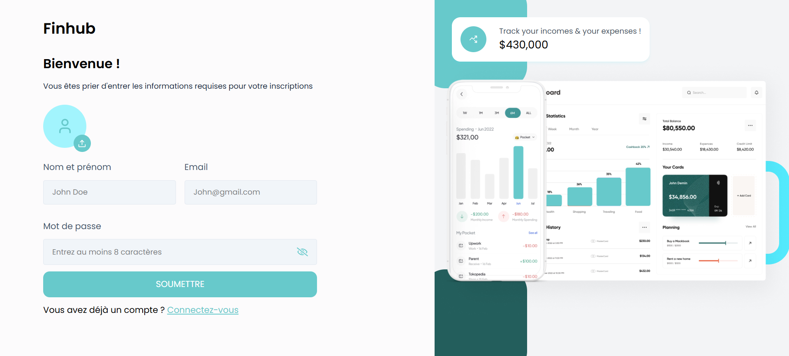

# 📊 Finhub

Finhub est une application web de gestion financière personnelle développée avec la **MERN Stack**.  
Elle permet de suivre ses revenus, ses dépenses et son solde en temps réel, tout en offrant des visualisations claires et intuitives.

---

## 🚀 Fonctionnalités

- ✅ **Tableau de bord** : aperçu global avec solde, revenus, dépenses et graphiques.
- ✅ **Transactions** : CRUD complet (ajout, modification, suppression, listing) des revenus et dépenses.
- ✅ **Visualisations** :
  - Graphiques des 30 et 60 derniers jours.
  - PieChart des revenus, dépenses et solde.
  - Graphique des sources de revenus.
  - AreaChart des dépenses groupées par jour.
- ✅ **Exports** : possibilité de télécharger le récapitulatif des revenus et/ou dépenses en format **Excel**.
- ✅ **Authentification sécurisée** avec **JWT**.

---

## 🛠️ Stack utilisée

- **Frontend** : React.js, Chart.js/Recharts, Tailwind CSS
- **Backend** : Node.js, Express.js
- **Base de données et ORM** : MongoDB avec Mongoose
- **Auth** : JSON Web Token (JWT)

---


## 📷 Aperçu de l'application

<div style="display: grid; grid-template-columns: 1fr 1fr; gap: 10px;">
  
  
  
  
</div>


---

## ⚙️ Installation et lancement

1. **Cloner le projet**
   ```bash
   git clone https://github.com/hermeskongo/Finhub.git
   cd Finhub


2. **Installer les dépendances**

   ```bash
   # Backend
   cd backend
   npm install

   # Frontend
   cd frontend/finhub
   npm install
   ```

3. **Configurer les variables d’environnement**
   Crée un fichier `.env` dans le dossier backend :

   ```env
   PORT=5000
   MONGODB_URI=your_mongo_connection_string
   JWT_SECRET=your_secret_key
   ```

4. **Lancer l’application**

   ```bash
   # Lancer backend
   cd backend
   npm run dev

   # Lancer frontend
   cd frontend/finhbu
   npm start || npm run dev
   ```

---

## 📌 Roadmap (idées futures)

* 🔹 Ajout de notifications pour les grosses dépenses.
* 🔹 Export en PDF en plus du format Excel.
* 🔹 Ajout d’objectifs financiers (budgets, épargne, etc.).
* 🔹 Ajout de la fonctionnalité de tri par date personnalisé
* 🔹 Ajout de la fonctionnalité de liaison au compte bancaire
* 🔹 Transaction bancaire directement via par la plateforme
* 🔹 Implémenter le responsive au plus vite 😅

---

## 👨‍💻 Auteur

Développé par **Hermès KONGO**.
Projet réalisé avec ❤️ pour gérer et optimiser ses finances personnelles.

